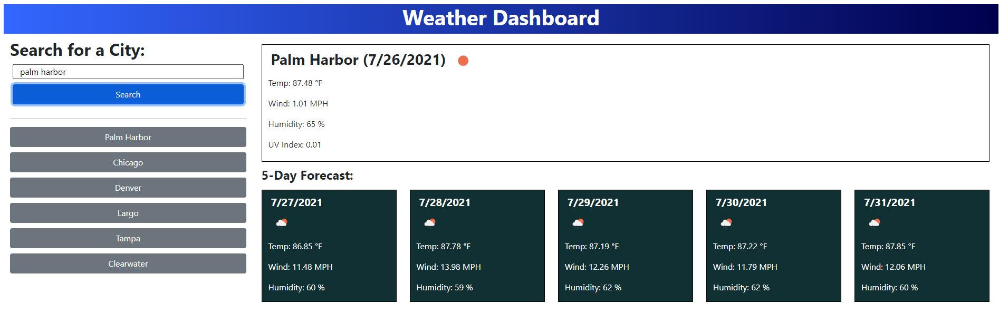

# Weather-Forcast-Dashboard
The forecast dashboard allows the user to search for a city's current weather conditions, as well as, a five day forecast. Previous searches are stored to localStorage and displayed below search button.

## Goal
Practice using server-side API calls whiling aiming to develop something that closely matches reference image.

## Built with
* HTML
* CSS
* JavaScript
* OpenWeatherMap API
* JQuery
* Moment
* Bootstrap

## Reference Image
 

## Website
https://mtastalos.github.io/Weather-Forecast-Dashboard/

 
 

 ## Contribution
 Made By Michael Astalos 
